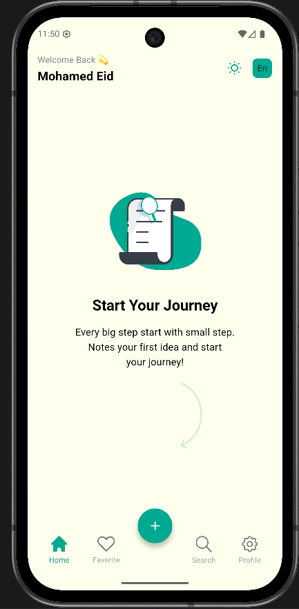
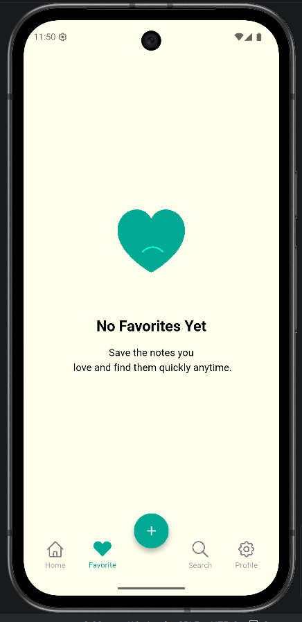
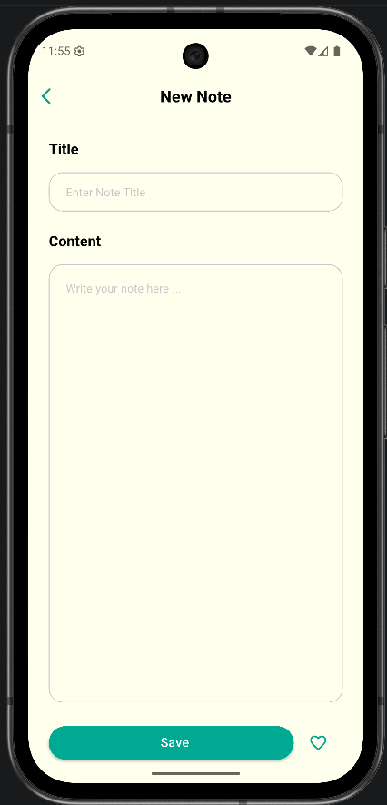
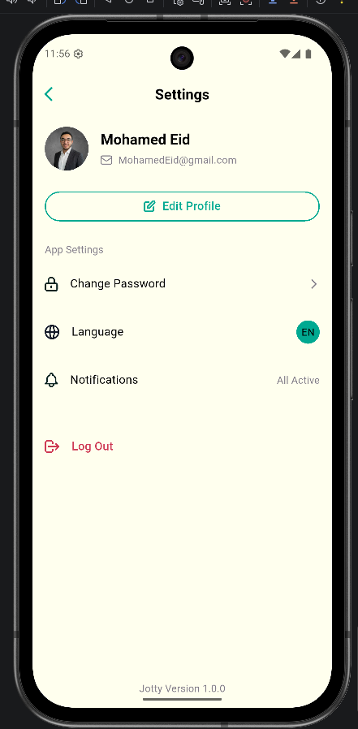

# 📝 Notes App

A clean and modern Notes App built with Flutter.

## 🚀 Features

- 🗂️ Create, edit, delete notes
- 🌙 Dark Mode
- 🌍 Multi-language (AR / EN)
- ⭐ Favorite notes
- 🔍 Search functionality
- 🔐 Firebase Authentication
- ☁️ Cloud Firestore Sync

## 📸 Screenshots

## 🛠️ Tech Stack

- Flutter
- Provider (State Management)
- Hive (Local Storage)
- Firebase Auth
- Cloud Firestore

## 📂 Project Structure

## 🎥 Demo

(Add video link here)

## 👨‍💻 Author

Mohamed Eid
